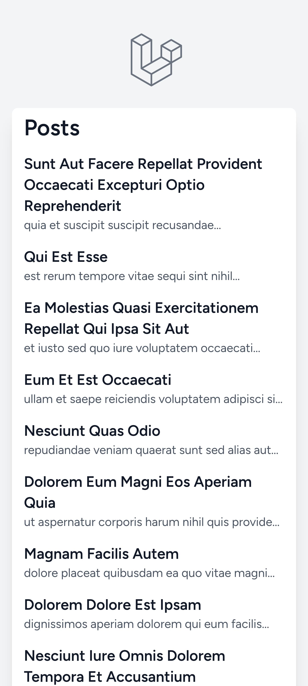
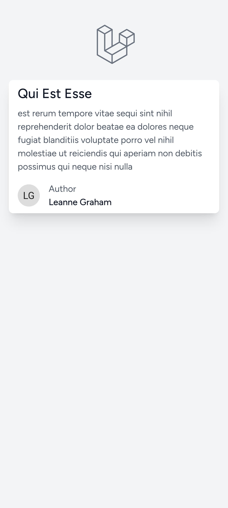
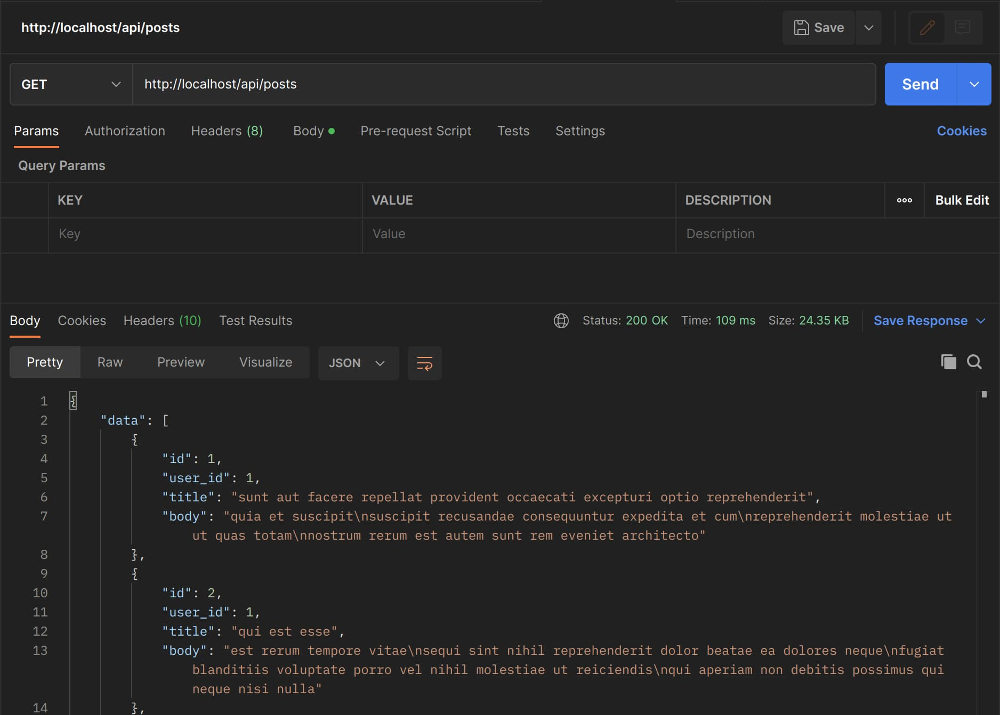
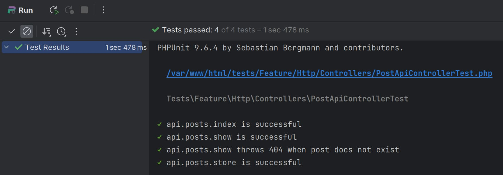

# Prueba técnica para Hays

  
  

  

  

## Requerimientos

Los requerimientos se pueden leer en
el [PDF que me enviaron](public/Prueba%20técnica%20-%20Senior%20PHP%20Symfony-Laravel.pdf).

## Descripción

### Uso

Visita [/posts](http://localhost/posts) para ver la lista de posts.

### Tecnologías

El proyecto se ha desarrollado con Laravel 10 y PHP 8.2, usando Composer.
La base de datos es MySQL 8.0.

Los tests se han desarrollado con PHPUnit y Pest.

El frontend y assets se procesan con Vite.

Los git commits se han hecho usando [Conventional Commits](https://www.conventionalcommits.org/en/v1.0.0/).

### Librerias

Como librerias externas se han usado:

- TailwindCSS
- Laravel Pint (custom PHP CS Fixer)

> Para usar pint: `./vendor/bin/sail php ./vendor/bin/pint`

### API

Se ofrece documentation de la API con la specification OpenAPI usando el
comando `./vendor/bin/sail artisan l5-swagger:generate`.

Para ver la documentación, se puede acceder a [/api/documentation](http://localhost/api/documentation).

### Problemas encontrados

#### OpenAPI

La libreria que se usa para generar la documentación de la API es bastante escasa en información, por lo que la
implementación no es muy buena.

### Soluciones Alternativas

#### Unit Testing

Se ha usado Pest sobre PHPUnit para los tests, ya que facilita la escritura de tests y experiencia de desarrollo.

## Instalación y uso

1. Clonar el repositorio
2. Instalar las dependencias -
   Usar [estas instrucciones](https://laravel.com/docs/10.x/sail#installing-composer-dependencies-for-existing-projects)
2. Crear un fichero `.env` a partir del `.env.example`
3. Usar Laravel Sail para levantar el proyecto - `./vendor/bin/sail up`
4. Ejecutar los tests - `./vendor/bin/sail artisan test`
